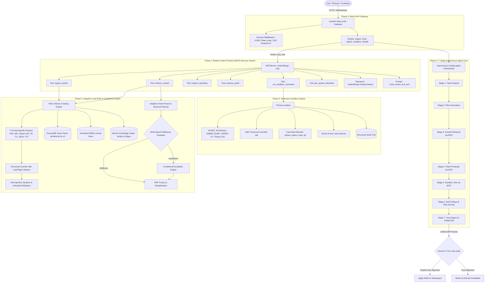

# SentinelForge System Flow & Architecture (`flow.md`)

This document details the end-to-end operational flow, data lifecycle, and communication bridges across all SentinelForge subsystems.

---

## 1. High-Level Architectural Flow



---

## 2. Ingestion & Tri-Store Indexing Data Flow

> **Core Operating Principle**: SentinelForge uses the least expensive retrieval modality capable of answering the query and escalates to OCR, Visual RAG, or GraphRAG only when additional evidence is required.

```
File Ingest Request (PDF, MD, Python AST, JS, TS, JSON, TXT)
       │
       ▼
1. Size & Extension Validation (Max 20MB for PDF, 10MB other; .pdf, .md, .py, .js, .ts, .json, .txt)
       │
       ▼
2. SHA-256 Content Hashing (Full file hash)
       │
       ├── Is Hash Already Present in All Stores (Vector + BM25)?
       │     ├── YES ──> Skip re-embedding; Return "already_indexed" (Deduplication)
       │     └── NO  ──> Proceed to incremental parsing & indexing
       │
       ▼
3. Format-Specific Structural Parsing (7 Isolated Parsers):
       ├── PDF: Page-aware parser with Canonical Page Store & Deterministic Classifier:
       │        ├── Page Type Classification:
       │        │     ├── TEXT_PAGE: Standard text layer (>= 50 chars, no images)
       │        │     ├── SCANNED_PAGE: Minimal text (< 40 chars) + image layer
       │        │     ├── VISUAL_HEAVY_PAGE: Diagram/chart label or high image area ratio
       │        │     ├── MIXED_PAGE: Both text and images present
       │        │     └── EMPTY_OR_UNREADABLE_PAGE: Zero text and zero images
       │        ├── Canonical Page Record Generation:
       │        │     - Preserves 1-indexed page_number, doc_id, text metrics, and statuses
       │        │     - Persisted to SQLite: ./data/chroma/canonical_pages.db
       │        └── Cheap Text Indexing (Bypasses OCR & Visual by default!)
       ├── Python: Python AST parser (ast.FunctionDef, ast.ClassDef) -> line ranges & calls
       ├── JavaScript: JS structural parser -> function/class/export boundaries
       ├── TypeScript: TS structural parser -> interfaces, types, classes, exports
       ├── Markdown: Section-aware header parser (#, ##, ###) -> section hierarchy
       ├── JSON: Structural JSON parser -> top-level keys, schemas, configs
       └── Text: Text parser -> line-bounded blocks
       │
       ▼ (All Parsers Normalize to ParsedSection schema)
       │
4. Structure-Aware Chunking:
       - Preserves {filename, page, start_line, end_line, sha256, section, chunk_type}
       │
       ▼
5. Anti-Injection Sanitization:
       - Scans for 8 threat patterns ("ignore previous instructions", delimiter attacks)
       - Escapes closing tags & neutralizes malicious prompt hijacking
       │
       ├──► 6A. Vector Store (ChromaDB):
       │        - Local SentenceTransformers (all-MiniLM-L6-v2 CPU)
       │        - Persistent collection with cosine distance
       │
       ├──► 6B. Lexical Store (BM25):
       │        - CamelCase & snake_case decomposing tokenizer
       │        - Persistent inverted index for exact symbol matching
       │
       └──► 6C. Knowledge Graph (SQLite):
                - Deterministic entity extraction (FILE, CLASS, FUNCTION, INTERFACE, CONFIG)
                - Structural relations (DEFINES, CALLS, INHERITS, IMPORTS, REFERENCES, CONFIGURES)
                - Line-level provenance & citations
```

---

## 3. Query-Adaptive Retrieval & Lazy On-Demand Execution

```
User Query (e.g. "what does page 2 show in invoice.pdf" or "where is OrderProcessor defined")
       │
       ▼
1. Multi-Signal Intent Classification & Metadata Cross-Reference:
       ├── Checks: Query syntax, target entities, and explicit page references (e.g. "Page 4")
       ├── Checks: Canonical Page Store metadata (what is Page 4's classified PageType?)
       ├── Checks: Modality availability (is OCR enabled? is Visual RAG active?)
       │
       ├── Normal Concept ────────> Intent: SEMANTIC_LOOKUP        (Strategy: Vector-only)
       ├── Exact Code Symbol ─────> Intent: EXACT_SYMBOL          (Strategy: Lexical BM25 + Vector)
       ├── Scanned Document ──────> Intent: SCANNED_TEXT          (Strategy: Lazy OCR + Vector)
       ├── Diagram / Flowchart ───> Intent: VISUAL_QUESTION       (Strategy: Lazy Visual + Vector)
       ├── Dependency / Caller ───> Intent: RELATIONSHIP_DEPEND   (Strategy: Graph 1-hop)
       ├── Impact / Blast Radius ─> Intent: IMPACT_ANALYSIS       (Strategy: Graph 2-hop + Vector)
       ├── Architectural Flow ────> Intent: MULTI_HOP_ARCH        (Strategy: Graph 3-hop + Vector)
       └── Debugging / Root Cause ─> Intent: COMPLEX_DEBUGGING     (Strategy: Vector + Lexical + Graph)
       │
       ▼
2. Targeted Minimal Execution (Lazy On-Demand):
       - If OCR requested: Checks disk cache -> if missing, runs local OCR on target page(s) -> caches result
       - If Visual requested: Checks disk cache -> if missing, inspects visual regions -> caches result
       - If Semantic requested: Completely bypasses OCR, Visual RAG, and GraphRAG!
       │
       ▼
3. Reciprocal Rank Fusion (RRF) & Content Deduplication:
       - Merges multi-source result rankings: RRF_score = 1 / (60 + rank)
       - SHA-256 chunk deduplication across text, OCR, visual, BM25, and graph
       │
       ▼
4. Multi-Signal Sufficiency Evaluation (Configurable):
       - Checks: Result count, top score baseline, score margin, exact symbol presence
       │
       ├── Sufficient? ────► Return Fused Results + Execution Trace
       │
       └── Insufficient? ──► Conditional Escalation:
                               ├── Vector-only lacked margin? ──> Query Lexical BM25
                               ├── Scanned document low score? ──> Trigger Lazy OCR fallback
                               └── Graph was skipped? ──────────> Traverse 1-hop Graph
                               └── Re-blend & return final context
       │
       ▼
5. Defensive Context Wrapping:
       Wraps untrusted snippets inside strict XML delimiters:
       <untrusted_document_context source="invoice.pdf:Page 2 [OCR]" score="0.85">
       ...raw snippet...
       </untrusted_document_context>
```

---

## 4. Human-In-The-Loop (HITL) Patch Verification Flow

1. **Agent proposes code changes** $\rightarrow$ calls `propose_patch` MCP tool.
2. `propose_patch` computes a standard unified diff against workspace files and validates Python AST syntax.
3. **Crucial Invariant**: Disk files remain pristine (`PENDING_APPROVAL`).
4. **Sandbox dry-run**: The candidate changes are tested in an isolated test environment without modifying the main branch.
5. User reviews the unified diff in the UI $\rightarrow$ clicks **[Approve]** or **[Reject]**.
6. Only upon explicit **Approve** does the system atomic-write the patch to disk.

---

## 5. Phase 4 7-Stage Autonomous Agent Core Flow

The Agent Core orchestrates code generation, debugging, and verification through a sequential, feedback-driven pipeline connecting to existing MCP tools and security invariants:

```
User Task Objective
       │
       ▼
[Stage 1: Task Analysis]
  - Parses requirements, affected modules, edge cases, and acceptance criteria.
       │
       ▼
[Stage 2: Plan Generation]
  - Formulates discrete, test-driven implementation steps and verification commands.
       │
       ▼
[Stage 3: Context Retrieval via MCP]
  - Invokes `retrieve_context` MCP tool to obtain line-level citations from vector, BM25, & knowledge graph.
       │
       ▼
[Stage 4: Patch Proposal via DiffGenerator & MCP]
  - Synthesizes updated file content.
  - DiffGenerator parses AST (`ast.parse`) for syntax errors.
  - Calls `propose_patch` MCP tool $\rightarrow$ registers `ActionProposal` in ApprovalManager.
  - Disk file remains untouched (`PENDING_APPROVAL`).
       │
       ▼
[Stage 5: Sandbox Execution via MCP]
  - Invokes `run_sandbox_command` MCP tool to run the test suite (`pytest`, `unittest`, `node`).
  - Enforces `setrlimit` CPU/memory limits, path jail, and output truncation.
       │
       ▼
[Stage 6: Self-Critique & Risk Scoring]
  - Inspects test stdout, stderr, exit code, and regressions.
  - Assesses risk score (1–10) and formulates recommendations.
  - If tests fail, preserves truthful error details rather than claiming success.
       │
       ▼
[Stage 7: Final Report & Unified Diff]
  - Assembles structured Markdown report (objective, citations, diff, test results, critique).
  - Emits status: `WAITING_FOR_HUMAN_APPROVAL` with `request_id` and canonical `action_hash`.
  - Records structured `AGENT_LOOP_COMPLETED` event in the audit trail.
```

---

## 6. Phase 5 React Interactive UI Architecture

The React frontend (`src/web/`) connects the operator to the 7-stage autonomous agent execution loop using an aesthetic inspired by `superbuilt.ai`:

1. **Atmospheric Dark Visual Layer**:
   - Deep pitch black base (`#000000`) with ambient radial cyan/cobalt/emerald blur orbs.
   - Frosted glassmorphism floating panels (`backdrop-blur-2xl`, `border-white/10`).
   - Clean modern typography with `Plus Jakarta Sans` and `JetBrains Mono`.

2. **Core Component Flow**:
   - **Main Agent Workspace (`App.tsx`)**: Input hero with prompt input bar, real-time stage status, and multi-tab layout.
   - **7-Stage Visual Stepper (`StageStepper.tsx`)**: Displays discrete progression across Analysis, Plan, RAG, Patch, Approval, Apply, Test, Critique, and Report.
   - **Unified Diff Viewer (`DiffViewer.tsx`)**: Side-by-side / unified diff viewer with addition/deletion line counters, AST syntax validation indicator, and copy actions.
   - **Human Authorization Gate Modal (`ApprovalModal.tsx`)**: Prominent modal halting disk mutation pending operator cryptographic token generation.
   - **Isolated Sandbox Terminal (`SandboxTerminal.tsx`)**: Collapsible dark terminal showing real-time command output, exit codes, and durations.
   - **Context & Citations Panel (`CitationsPanel.tsx`)**: Displays RAG-retrieved workspace code chunks, file metadata, and security verdicts.
   - **Structured Audit Trail (`AuditTimeline.tsx`)**: Real-time append-only timeline of all security events with SHA-256 action hashes.
   - **Execution Summary & Critique View (`FinalReportView.tsx`)**: Formats empirical test verdicts, risk evaluations, and completion reports.
   - **Service Abstraction (`services/api.ts`)**: Clean service layer designed for easy transition to real FastAPI endpoints.

